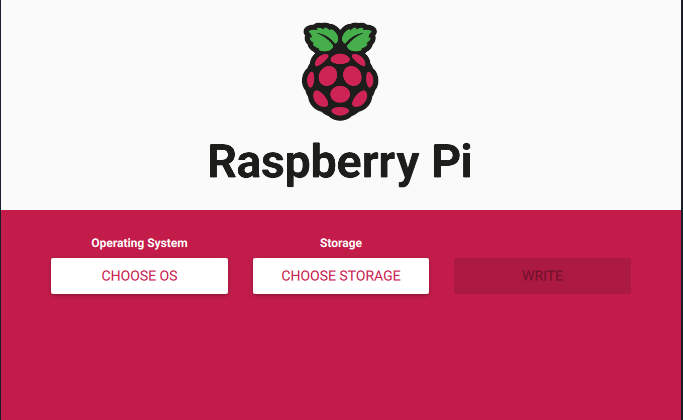
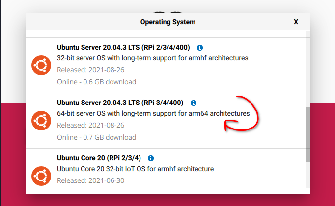
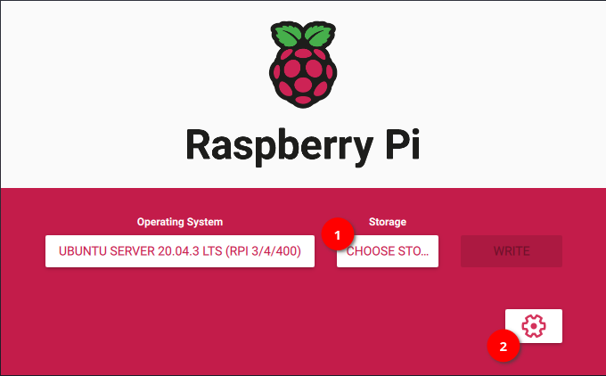
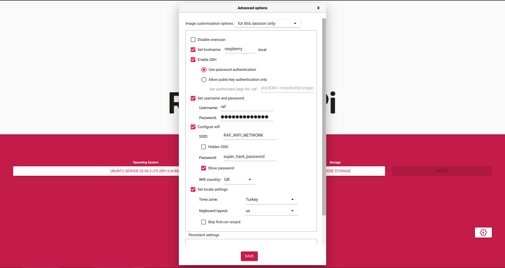
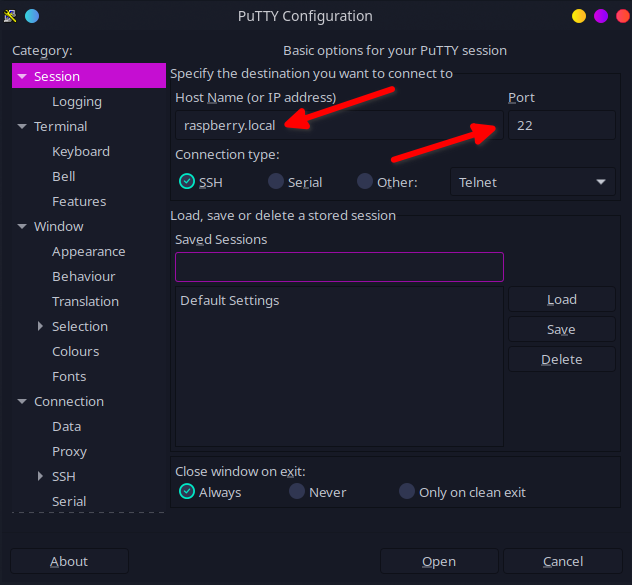

import Tabs from '@theme/Tabs';
import TabItem from '@theme/TabItem';

Welcome to this blog! This page will provide instructions on how to install and run BrayanBot on a **Raspberry Pi 400** running Ubuntu 20.04. Interested? Great! Grab your popcorn, drinks, Raspberry Pi and click "Read More" to proceed.
<!--truncate-->

First and foremost, happy Valentines Day everybody!
If you are single, I will be your company *and* guide today. If not, I will only be your guide, but nevertheless; I am your guide today I hope to provide what you will need to host BrayanBot on a Raspberry Pi 400 running Ubuntu. Certainly not my favorite distribution but nevertheless, it somehow still holds the title of the most popular server distro.
> *If you would like to read my take on this matter, more about why you should not be using Ubuntu [here](/).*

But I digress, let us proceed with installation steps right away before I steal more of your time.

As you would expect, you will need a Raspberry Pi to connect to your server. Many people do not realise this, but Raspberry Pi is an awesome tech utility to have!
You can run a website on it, or make a LEGO Tank with it. Or, as any sane person would do: you can use it to host BrayanBot, which we will do!

## Installing Ubuntu on our Raspberry Pi

My Raspberry Pi 400 (like many others) came with its own Ubuntu spin, NOOBS operating system. It is a decent Ubuntu derivative that aims to introduce beginners to the basics of Linux but it also comes with Desktop Environment, which we do not need. That is exactly why we will be overwriting NOOBS with Ubuntu using this handy tool called [Raspberry Imager](https://www.raspberrypi.com/software/). It can be installed on Windows MacOS and Ubuntu from downloads page. Arch Linux users may install it from the AUR using `yay -S rpi-imager` or `yay -S rpi-imager-bin`. Install Imager and run it for the first time. It will look like this:<br/><br/>
<br/><br/>
We will be choosing our operating system and storage medium, but before that I would like to talk about my personal recommendations.<br/><br/>
> Raspberry Pi 400 came with a 16GB SD card, which after around 2 weeks of use time; has proven itself to be insultingly low. If you are planning to use your Pi only to host BrayanBot, 16GB is perfectly enough; but if you have other awesome projects in mind, you might want to consider a 32 or 64 GB card.

Regardless of your choice, choose your Operating System under the **Choose OS** tab.
For this guide, we will be going with Ubuntu 20.04 Server (64 Bit) as our operating system but depending on your preferences, you may want to go with a different version of Ubuntu or an entirely different Operating System. For those sick of Ubuntu  Arch Linux is an excellent alternative, however, Manjaro may be a temporary stepping stone as installing Arch linux on a Raspberry Pi is relatively difficulty for a newbie.<br/>



Once you choose your Operating System, proceed to choosing your storage medium. I have used an 32 GB SD card in this installation but you may go as low as 16GB (any lesser might cause you problems) for this project. There are no upper limits to storage, you might as well buy a 1TB SD Card and use your Raspberry Pi as a desktop computer. Go wild!



Next up, is the most important step; configuring your SSH & Network connections.



Things to note here:

**Set hostname Setting**

> Hostname is what you will use to connect to your Raspberry. Set it to anything you would like, it can be changed later from `/etc/hostname`

**Enable SSH Setting**

> This will basically allow SSH connections to your Pi. It is important that this setting is enabled, unless you plan on plugging in a monitor and configuring it later.

**Set username and password Setting**

> This will create your user with sudo permissions and desired password. In this example, **raf** is my username and it is what I will log in to the server with.

**Configure Wifi Setting**
> Second most important setting is your Wifi. You may be planning to use your Pi connected to the internet with a cable, but if your Raspberry also has a single ethernet port like mine; you will want to use that port for a cable between your PC and Raspberry, so you can SSH locally. In this example **SSID** is the name of my Wifi network.

**Set locale settings**

> While not too important, its easier to configure them on this screen rather than after connecting to your raspberry. Choose your country and keyboard layout. As my Raspberry Pi comes with an US keyboard, I went with the default, US, but you may choose to use something different if your keyboard layout is different or if you have connected your own keyboard to your Pi.

Once all important setings are configured, hit save and then press the **Write** button to start burning the image on your SD card. This may take a little while. Why not grab a cup of coffee while we wait?

## SSHing into the Server

We have successfully installed Ubuntu on our Raspberry Pi and it is ready to go! Insert your SD card to your Raspberry Pi and plug it to a power source. My Raspberry Pi came with a desktop kit, which included a power cord and an adaptor but if you do not have it; any USB 3.0 power cable will do the trick.

Start by connecting the ethernet cable from your computer to your Raspberry Pi. This will allow you to connect from your device to the Pi **without** defining a static IP to your Pi and using SSH.

I already have a SSH configuration on my device and I normally use it to connect easily, but as we are intalling a fresh server onto our Raspberry Pi; you will need to set up SSH for the first time. To do that, you need to SSH into the server! How to do that, you ask? Well that's simple, we have already configured our credentials for SSH and we can use those credentials to SSH into our Pi easily. Lets open the command line (or if you are on Windows, a terminal emulator like [Ki[Putty](/) or Powershell) and SSH into the server using our username and password.

**Using Terminal**
```bash
ssh raf@raspberry.local
```

This will prompt you to enter your password, which you have set during the installation. Enter your password, put on your hoodie and whisper:
*"I'm in"*
Because that was the hard part! We have successfully made it into the server.

**Using Putty**<br/>

<br/>

Hit open and connect to the server. You may -most probably will- see a warning about fingerprints. Hit yes, this will add your Raspberry Pi's fingerprint to your computer's trusted hosts and will not show up again. After that, you will be connected to your server. Unfortunately if you have used Putty, you do not get to put on a hoodie and whisper *"I'm in"* but it is a perfect time to consider switching to Linux as your operating system! No pressure.

## Installing NodeJS

First and most importantly, update your packages.
```bash
sudo apt update && sudo apt upgrade
```
Then, you would normally run something like `sudo apt install nodejs npm` but NO! Since Ubuntu is a distro known for [leaving their packages outdated](/) the NodeJS from `apt install` is not the one we need. There are many third party repositories, one of which you may choose to install NodeJS but as the "third party" in the name indicates; they are not *always* trustable and thus, we will install it the *right way*.

The Raspberry Pi runs off the ARM architecture and as of the writing of this article, NodeJS releases compiled Linux binaries for ARMv6, ARMv7 and ARMv8 architectures, all of which you may find on their website

To find out which architecture your Raspberry Pi is running on, run the following command in the terminal

`uname -m`

For example, if we run the above command on the Raspberry Pi 400, we get the following output. 

`armv7l`

*Below, you will find a list of system architechtures for common Pi models but it is always a safe bet to check with `uname -m` as it may differ between devices despite sharing the same model number*

  |        Board Name         |       Architechture     |
  | :-----------------------: | :---------------------: |
  | Raspberry Pi 400 	        |          ARMv7          |
  | Raspberry Pi 3 /3B+ 	    |          ARMv7					|
  | Raspberry Pi 2B v1.2 	    |          ARMv7					|
  | Raspberry Pi 2B 	        |          ARMv6					|
  | Raspberry Pi Zero /Zero W | 	       ARMv6					|
 
We will now download the appropriate NodeJS release from NodeJS downloads page. To host BrayanBot, we will need [NodeJS V16](https://nodejs.org/dist/v16.14.0/) or [NodeJS V17](https://nodejs.org/dist/v17.5.0/)

Once you determine the apporpriate version, for example `node-v14.19.0-linux-armv7l.tar.gz` for a Raspberry Pi with ARMv7 archtechture version, install the relevant package with `wget node-vXX.XX.X-linux-armvXl.tar.gz` (replace X with your node version and architechture) abd extract the file you have downloaded with `tar -xzf node-vXX.XX.X-linux-armvXl.tar.gz`. After downloading, move into the tar you have extracted with `cd node-vXX.XX.X-linux-armvXl` and copy the contents to PATH using `sudo cp -R * /usr/local/`

Before you proceed, check if your installation was successful by running `node -v` and `npm -v` If it is, proceed to the next step. If not, join our [Discord Server](/discord) and ask for help.

Finally, we are ready to download and install BrayanBot

## Installing BrayanBot

### Install Dependencies

<Tabs>
<TabItem value="debian" label="Debian/Ubuntu">

```bash
sudo apt install zip unzip wget 
```

</TabItem>
<TabItem value="arch" label="Arch">

```bash
sudo pacman -S zip unzip wget
```

</TabItem>
<TabItem value="fedora" label="RedHat/CentOS/Fedora">

```bash
sudo dnf install zip unzip wget
```

</TabItem>
</Tabs>

### Download and Install BrayanBot
<Tabs>
<TabItem value="stable" label="Stable">

1. Download the zip file and unzip
```bash
wget https://github.com/brayanbotdev/brayanbot/releases/download/latest/brayanbot.zip &
unzip brayanbot.zip
```
1. Move into the BrayanBot Directory
```bash
cd BrayanBot
```
3. Copy the example config to the main `config.yml` 
```bash
cp example.config.yml config.yml # cp is a built-in Linux command for copying files
```
**or if you would like to simply rename the file**
```bash
mv example.config.yml config.yml # mv is a built-in Linux command for moving files
```
4. Edit your `config.yml`
```bash
nano config.yml
```
**or**
```bash
vim config.yml # Imagine using vim
```
</TabItem>
<TabItem value="Dev" label="Dev">

:::danger Dev Branch
If you are interested in receiving updates *as soon as they are out* for the cost of high chance of breaking changes and less stability; you may clone into the **dev** branch instead of **main**. Changes from the dev branch will be *eventually* merged into main, but it is an option for those who like to live on edge.
You also must keep in mind that using `git` will set up version control for your bot files and will make it harder to update if you have edited default -and tracked- bot files. **Do not** use this branch if you do not know how to use **git**.
:::

1. Clone the Github Repo
```bash
git clone -b dev https://github.com/BrayanBotDev/BrayanBot.git
```
2. Move into the BrayanBot Directory
```bash
cd BrayanBot
```
3. Copy the example config to the main `config.yml` 
```bash
cp example.config.yml config.yml 
```
**or if you would like to rename the file instead of copying**
```bash
mv example.config.yml config.yml
```
4. Edit your `config.yml`
```bash
nano config.yml
```
**or**
```bash
vim config.yml
```
</TabItem>
</Tabs>

### Installing NodeJS Dependencies & Starting BrayanBot

<Tabs>
<TabItem value="yarn" label="Yarn">

1. Install Yarn
```bash
sudo npm i -g yarn
```
2. Install Required dependencies
```bash
yarn
```
3. Start the Bot
```bash
yarn start
```

</TabItem>
<TabItem value="npm" label="NPM">

1. Install Required dependencies
```bash
npm install
```
2. Start the Bot
```bash
npm run start
```

</TabItem>
</Tabs>

## Power Controls
If you would like to keep the bot running after you log out of your terminal/machine; you may use **PM2**. It will also allow you to have BrayanBot persist between reboots, if you configure it that way.
### Using PM2 Process Manager

```bash
# Install PM2 through NPM
sudo npm install -g pm2
# Start BrayanBot with PM2
pm2 start index.js --name brayanbot
```

- `pm2 stop brayanbot` # Stops the pm2 process
- `pm2 restart brayanbot` # Restart the process
- `pm2 logs brayanbot` # View recent logs as well as a live console
- `pm2 logs brayanbot --lines 1000 | nc termbin.com 9999` # Export the bot's past logs and paste them to termbin.


## Final Thoughts

>And that's it, that is all you need to do to start hosting BrayanBot without additional hosting costs. Of course, leaving a Raspberry Pi running 24/7 is not the most reliable way of running a service, BUT, using a Raspberry Pi creates an excellent sandbox for you get into using Linux and understanding the basics of running/securing a server without additional costs or risks. Once you feel comfortable with using this new server on your Raspberry Pi, you should consider taking a look at my [Securing your Linux Server](/hardening-linux-server) guide. As some of our users have decided to purchase VPSes to run BrayanBot, we felt obligated to provide necessary instructions on securing your server. If you find this guide helpful, I'm glad! If you think it was the most unhelpful guide you have ever read, please let me know, so I can improve it. And if you just want to talk Linux, that's fine too! Join our [Support Server](/discord) where we can talk freely.

With that said, I really do hope this guide was useful, thank you for your time.
